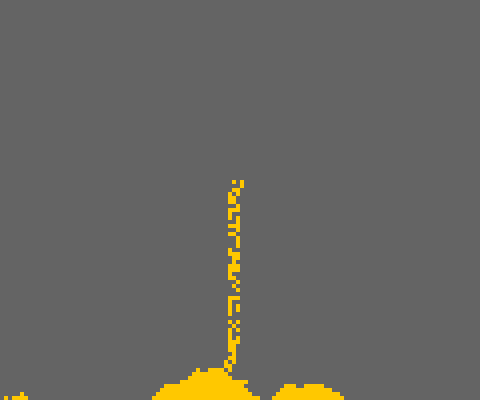

# Sand
'Sand' is my very first project created in JavaScript with p5.js library.

## Instruction
- To play 'Sand', open the file _index.html_ in your browser.
- Controls: left mouse button.
    

  
   
  

